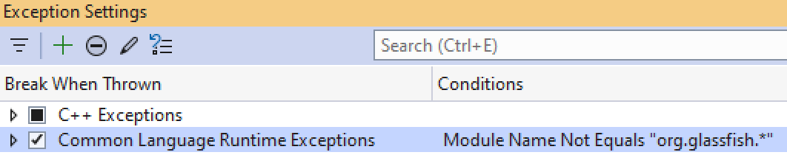

# Frequently Asked Questions
## General Questions

**Can I use MPXJ to write MPP files?**

Not at present. Although it is technically feasible to generate an MPP file, the
knowledge we have of the file structure is still relatively incomplete, despite
the amount of data we are able to correctly extract. It is therefore likely to
take a considerable amount of development effort to make this work, and it is
conceivable that we will not be able to write the full set of attributes that
MPXJ supports back into the MPP file - simply because we don't understand the
format well enough. You are therefore probably better off using MSPDI which does
support the full range of data items present in an MPP file.

**I'm generating output using MPXJ, and when my end users open the file in
Microsoft Project, I want to control the appearance of the project data that
they see. Can I do this with MPXJ?**

In short, the answer to this question is no. The only file format which allows
you to control the appearance of project data when opened in Microsoft Project
is MPP. Just to clarify, visual appearance in this context refers to the view
that appears when the project opens, the filtering applied to the view, the
table data visible, the columns in the table, bar styles, text styles and so on.
While MPXJ can read this information from an MPP file, none of the supported
output file formats contain these attributes.

**When I double click on an MPX file to open it in Microsoft Project, I end up
with two copies of the file open. What's happening?**

This isn't an issue with MPXJ - but we have an answer for you anyway! The
problem is caused by an incorrect setting in Microsoft Windows which controls the
way MPX files are opened. To fix the setting, open the Control Panel and click
on the "Folder Options" icon. Select the "File Types" tab and scroll down the
list of file types until you find an entry for MPX. Once you have found the
entry for MPX, click on it to highlight it, then press the "Advanced" button at
the bottom right hand side of the dialog. In the list of actions that you are
now presented with, click on the word "open" to highlight it, then click the
"Edit" button on the right hand side of the dialog. Finally, ensure that the
"Use DDE" check box is not checked, and you can now finish by clicking OK on
each of the open dialogs to dismiss them. You should now find that double
clicking on an MPX file will now only open one copy of the file in Microsoft
Project.

**I use a version of Java older than Java 8, can I use MPXJ?**

The last version of MPXJ which supports versions of Java prior to Java 8 is
version 7.9.8.

**I use a Java 1.4 JVM, but MPXJ is built with a later version of Java, is there
anything I can do which will allow me to use it?**

Yes there is. Assuming you are using a version of MPXJ prior to 8.0.0,
try using [Retroweaver](http://retroweaver.sourceforge.net/).

## Known Issues with MPXJ
**I have an MPP file created by MS Project 98, and some Flag field values
are incorrect.**

The MPP8 file format is rather cryptic, and one part of it that I have yet to
really understand fully is how the Flag fields are stored. I've spent a lot of
time looking at this and have not made a lot of progress, so at the moment no
further work is being undertaken to fix this. Contributions of insights,
knowledge or fixed code for this problem are welcome. You'll find a bug for this
item logged in the
[SourgeForge bug tracker](http://sourceforge.net/tracker/index.php?func=detail&aid=816347&group_id=70649&atid=528541).

**When I read an MPP file I sometimes see an extra task or resource record.**

What you are seeing are "hidden" tasks and resources which newer versions of
Microsoft Project appear to use as placeholders for summary information about
all of the tasks and all of the resources in a project. We're not sure exactly
which versions of Project hold data like this, although we think this is only
relevant for the MPP9 and MPP12 file formats. We've also noticed that the
information in these hidden tasks and resources may not be reliable, so don't
place too much emphasis on them in your application.

You can ignore the first resource if it has a null value as its name. The
attributes of this resource should actually be a summary of all of the resource
combined, e.g. utilisation, actual work, remaining work and so on for the
complete set of "real" resources.

You can ignore the first task if it has an outline level of zero, this task will
be a summary of all the "real" tasks in the project. You may also find that the
name of this task matches the name of the project.

**My localised version of MS Project won't read the MPX files created by MPXJ,
or MPXJ won't read the MPX files written by my localised version of MS Project.**

Localised versions of MS Project (i.e. those which have been translated for use
in a non-English locale) read and write MPX files which include localised text
strings. The end result of this is that an English/International version of MS
Project can't read MPX files produced by a localised version of MS Project, and
vice versa.

MPXJ supports a small number of non-English locales, and can read and write MPX
files correctly for those locales. You can also use MPXJ to translate MPX files
from one locale to another. The MPXFile.setLocale() method must be called prior
to reading or writing an MPX file in order to set the required locale. By
default, MPXJ will always produce MPX files for the International/English locale,
regardless of the locale for which your operating system if configured.

Supported locales for MPX files currently include German, Spanish, French,
Italian, Portuguese, Swedish, and Simplified Chinese. Producing a translation
for your locale is very easy, please contact us for details on how you can help
us to do this.

**When I write an MPX file, changes to the project header settings I've made
seem to be lost, what's happening?**

One of the first things the MPXWriter's write method does is to determine the
current locale and update various project settings (for example, currency and
date formats) to match the selected locale. This behaviour can be changed so
that the settings in the project are left unmodified by setting the
useLocaleDefaults parameter to false when calling the write method (for versions
of MPXJ up to and including 3.0.0) or by calling the method setUseLocaleDefaults
on the MPXWriter instance before calling the write method (for versions of MPXJ
after 3.0.0).

## Unit Tests
**I am trying to run the MPXJ unit tests and I'm having problems with failures
in JAXB functionality. What's happening?**

Older versions of JAXB were known to have issues with the JUnit classloader, so
running the JUnit test runner with the -noloading command line option, other
taking other steps to disable JUnit classloading was recommended. This problem
is not believed to affect the more recent version of JAXB now used by MPXJ.

## Java
**I've just update MPXJ and when I build my code I get the error
`package net.sf.mpxj does not exist`**

As part of the MPXJ 14 release, the package name for MPXJ changed from
`net.sf.mpxj` to `org.mpxj`. Find and replace references to the old package
name in your code with the new package name, and your code should compile
again. NOTE: the Maven Group ID for MPXJ has nit changed, and is still
`net.sf.mpxj` - you don't need to update your POM file, just any references to
`net.sf.mpxj` in your code.

## Python
**I've just updated MPXJ and when I try to run my code I get the error
`java.lang.ClassNotFoundException: java.lang.ClassNotFoundException: net.sf.mpxj`**

As part of the MPXJ 14 release, the package name for MPXJ changed from
`net.sf.mpxj` to `org.mpxj`. Find and replace references to the old package
name in your code with the new package name, and your code should run
again.

## .NET
**When using MPXJ from .NET Core I get an error similar to `No data is available
  for encoding 437. For information on defining a custom encoding, see the
  documentation for the Encoding.RegisterProvider method.`**

By default .NET Core does not include all of the character encodings which may
be used by MPXJ (and which are present by default in .NET Framework). To
resolve this issue add the following to your code:

```c#
System.Text.Encoding.RegisterProvider(System.Text.CodePagesEncodingProvider.Instance);
```

**I have set up a simple test project using MPXJ.Net, and when I try to do
anything with MPXJ, an exception is thrown**

One of the libraries MPXJ depends on throws and catches one or more exceptions
as part of its normal flow of control. These exceptions are handled, so you can
keep pressing continue, and your code should run normally after that.
Visual Studio is breaking on these exceptions even though they are
handled. You can prevent this behavior by adding this condition to the
"Common Language Runtime Exceptions" entry in the exception
settings window in Visual Studio: `Module Name Not Equals org.glassfish.*`,
as illustrated below.



**I have set up a simple test project using MPXJ.Net, and when I try to do
anything with MPXJ, Visual Studio crashes**

This is the same problem as described above. MPXJ is catching an exception being
raised in one of MPXJ's dependencies and, in the process, crashing. The
solution is the same: add the condition described above to ensure that Visual
Studio ignores this exception.

**I have set up a simple test project using MPXJ.Net, but when I run it I get
this error `System.IO.FileNotFoundException: 'Could not load file or assembly
'mpxj, Version=(version number), Culture=neutral, PublicKeyToken=(token)'
or one of its dependencies. The system cannot find the file specified.'`**

This is typically caused by MPXJ.Net being added as a dependency to a non
SDK-style project. MPXJ.Net will only work with an SDK-style project.
If you open your `csproj` file in a text editor, the first line should look
something like this: `<Project Sdk="Microsoft.NET.Sdk">`. If your `csproj`
file is different you will need to create a new SDK-style project. Sample
projects in this form can be found [in this repository](https://github.com/joniles/mpxj-dotnet-samples).

**I have an application which uses MPXJ.Net and runs fine on my local machine,
but fails with a Segmentation Fault when run in Docker**
When using Docker to host an application built with MPXJ.Net, you may find
that the application crashes with a segmentation fault when invoking MPXJ.Net
code. The issue is likely to be a library missing from the Docker image.
Adding the following line to your `Dockerfile` will ensure that the 
most common missing library is added:
`RUN apt-get update && apt-get install -y libfontconfig`

## log4j2
When you start MPXJ, you may see the following message written to the console:

```
ERROR StatusLogger Log4j2 could not find a logging implementation.
Please add log4j-core to the classpath. Using SimpleLogger to log to the console.
```

MPXJ uses Apache POI to read MPP files. Apache POI uses log4j2 to write log
messages. By default the only dependency POI has on log4j2 is to its
interfaces. If you're not already using log4j2 as part of your code, and you
don't explicitly include the rest of the log4j2 implementation jar files,
you'll see the warning message shown above. This message can safely be ignored,
it's just telling you that any log messages POI produces will be written to the
console. If you would like to silence this message, you can supply the
following argument to the JVM:

```
-Dlog4j2.loggerContextFactory=org.apache.logging.log4j.simple.SimpleLoggerContextFactory
```

If you are using the Python version of MPXJ, you can provide the argument as
shown below when you initialize `jpype`.

```python
jpype.startJVM("-Dlog4j2.loggerContextFactory=org.apache.logging.log4j.simple.SimpleLoggerContextFactory")
```
