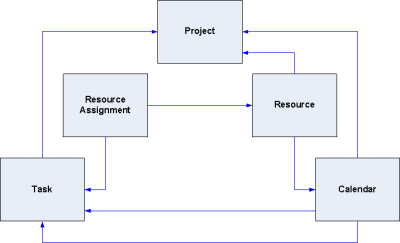

# MPXJ Basics

The MPXJ library allows various formats of Microsoft Project file formats, and
file formats from other project planning applications
to be read and written using a single consistent API in Java, .Net, Python or any other 
related languages, and provides read-only access as a Ruby gem.

MPXJ is based around a "neutral" data structure which is used to represent
project data, coupled with a set of format-specific reader and writer classes
which understand how to read from and write to the various supported file 
formats.

The diagram below illustrates the key entities represented by the MPXJ
data structure.



MPXJ currently allows project data to be read from a wide variety
of schedule file formats and databases. You can find details of the 
individual file formats supported elsewhere in the documentation.
By far the easiest way to read schedule data is to use the "universal project reader"
which can determine for itself the type of file you have passed to it.

```java
ProjectReader reader = new UniversalProjectReader ();
ProjectFile project = reader.read("example.mpp");
```

A similar arrangement exists for the writer classes, although there is not a
"universal project writer" as such:

 
* `org.mpxj.mpx.MPXWriter`: writes Microsoft MPX files
* `org.mpxj.mspdi.MSPDIWriter`: writes Microsoft MSPDI (XML) files
* `org.mpxj.planner.PlannerWriter`: writes Planner (XML) files
* `org.mpxj.sdef.SDEFWriter`: writes SDEF files
* `org.mpxj.primavera.PrimaveraPMFileWriter`: writes Primavera PMXML (XML) files
* `org.mpxj.json.JsonWriter`: writes JSON files (primarily used to support the Ruby version of MPXJ)

All of these classes implement the ProjectWriter interface. If you know which 
type of file you are working with, you can use these writers directly, 
for example:

```java
ProjectWriter writer = new MPXWriter();
writer.write(project, "example.mpx");
```

## Tasks and Resources
Once you've read your project file, what next? The first things of interest 
are the tasks and resources which are present in the file.


```java
ProjectReader reader = new UniversalProjectReader ();
ProjectFile project = reader.read("example.mpp");
for (Resource resource : project.getAllResources())
{
   System.out.println("Resource: " + resource.getName()
      + " (Unique ID=" + resource.getUniqueID() + ")");
}
```

The code fragment above shows how we can retrieve a collection containing
all of the resources present in the file, and iterate through them printing
the resource name, ID and unique ID.

Many of the entities represented in 
MPXJ have some concept of a unique ID. Tasks and resources have two ID fields,
the unique ID, which as its name suggests never changes and uniquely identifies
a task or a resource, and the ID. The ID of a task or a resource is the 
sequential number which typically appears next to the task or resource when 
displayed in Microsoft Project. If the task or resource is moved up or down 
the list, this number will change depending on the position in the list.
The unique ID never changes.

```java
ProjectReader reader = new UniversalProjectReader ();
ProjectFile project = reader.read("example.mpp");
for (Task task : project.getAllTasks())
{
   System.out.println("Task: " + task.getName() + " ID=" + task.getID()
      + " Unique ID=" + task.getUniqueID());
}
```

The code fragment above retrieves all tasks present in the file and prints
details of their names, IDs, and unique IDs. 

Methods are provided on the project to locate both tasks and resource using
either their ID or their Unique ID, as the examples below illustrate.

```java
Resource r = project.getResourceByUniqueID(Integer.valueOf(99));
Task t = project.getTaskByUniqueID(Integer.valueOf(99));
```

The methods shown above for retrieving all tasks present in a project file
ignores the hierarchical task structure which Microsoft Project allows users
to create. To understand the hierarchical task structure, the following methods
are used to descend through the hierarchy, starting from the top.

```java
List<Task> tasks = project.getChildTasks();
Task task = tasks.get(0);
tasks = task.getChildTasks();
```

These methods are used in the following code fragment to print out an indented
list representing the task hierarchy in the file.  

```java
public void listHierarchy(ProjectFile file)
{
   for (Task task : file.getChildTasks())
   {
      System.out.println("Task: " + task.getName());
      listHierarchy(task, " ");
   }

   System.out.println();
}

private void listHierarchy(Task task, String indent)
{
   for (Task child : task.getChildTasks())
   {
      System.out.println(indent + "Task: " + child.getName());
      listHierarchy(child, indent + " ");
   }
}
```

As well as the hierarchical relationships between tasks, there is also
a temporal relationship between them: this is typically used to indicate
when a task can start in relation to the completion of an earlier task. The 
code fragment below shows the predecessor relationships between tasks. 

```java
for (Task task : file.getAllTasks())
{
   List<Relation> predecessors = task.getPredecessors();
   if (predecessors != null && !predecessors.isEmpty())
   {
      System.out.println(task.getName() + " predecessors:");
      for (Relation relation : predecessors)
      {
         System.out.println("   Task: " + file.getTaskByUniqueID(relation.getTaskUniqueID()).getName());
         System.out.println("   Type: " + relation.getType());
         System.out.println("   Lag: " + relation.getDuration());
      }
   }
}
```

## Resource Assignments
Tasks and resources are related by resource assignments. There is a method 
available on the ProjectFile class which will retrieve all resource assignments
in the file. This is used by the code fragment below to provide an overview
of all assignments.

```java
for (ResourceAssignment assignment : file.getAllResourceAssignments())
{
   Task task = assignment.getTask();
   String taskName;
   if (task == null)
   {
      taskName = "(null task)";
   }
   else
   {
      taskName = task.getName();
   }

   Resource resource = assignment.getResource();
   String resourceName;
   if (resource == null)
   {
      resourceName = "(null resource)";
   }
   else
   {
      resourceName = resource.getName();
   }

   System.out.println("Assignment: Task=" + taskName + " Resource=" + resourceName);
}
```

Resource assignments can also be retrieved on a task-by-task basis, as the
code fragment below illustrates.

```java
for (Task task : file.getAllTasks())
{
  System.out.println("Assignments for task " + task.getName() + ":");

  for (ResourceAssignment assignment : task.getResourceAssignments())
  {
     Resource resource = assignment.getResource();
     String resourceName;

     if (resource == null)
     {
        resourceName = "(null resource)";
     }
     else
     {
        resourceName = resource.getName();
     }

     System.out.println("   " + resourceName);
  }
}
```

Finally, resource assignments can be viewed on a resource-by-resource basis,
as the following code fragment shows. 

```java
for (Resource resource : file.getAllResources())
{
   System.out.println("Assignments for resource " + resource.getName() + ":");

   for (ResourceAssignment assignment : resource.getTaskAssignments())
   {
      Task task = assignment.getTask();
      System.out.println("   " + task.getName());
   }
}
```

## Calendars
Calendars are used to define working and non-working time, and are one of the more
complex structures defined as part of a project. They are in turn used to define
the time period over which a task is scheduled. There are two types of calendar: 
base calendars and resource calendars. Each base calendar provides a complete 
definition of the working and non working time for each day of the week. 
Resource calendars are associated with individual resources. Each resource 
calendar is derived from a base calendar; resource calendars may be unmodified
in which case it will appear to be identical to the underlying base calendar, 
or the resource calendar may modify the working and non-working days. In this
case these changes are "overlaid" on top of the working and non-working times
defined by the base calendar. The calendars defined in a project can be retrieved
using the method call shown below.

```java
List<ProjectCalendar> calendars = file.getCalendars();
```

Normally a task without resource assignments will be scheduled with reference 
to the "Standard" (default) calendar defined as part of the project. This is
retrieved using the method calls shown below.

```java
ProjectCalendar defaultCalendar = file.getDefaultCalendar();
```

It is also possible to associate a specific calendar with an individual task.
The method call below shows the calendar associated with a task being retrieved.  

```java
ProjectCalendar taskCalendar = task.getCalendar();
```

Bearing in mind that one calendar may be derived from another, care must be 
taken when choosing the methods called on a calendar instance: some methods
are used to retrieve attributes defined as part of that specific calendar only,
while others are used to descend through the hierarchy of calendars until an
"actual" value is retrieved. For example the getDays method will retrieve an
array of flags indicating the working/non-working/default state of each day
of the week as defined by the current calendar. The getDay method however will
test the current calendar to see if it is a working or non-working day. If the 
flag in the current calendar is set to "default", the method will use the
base calendar from which the current calendar is derived to determine if the
day is working or non-working.   

As noted above a calendar contains a set of flags which represent  each day of
the week, these  indicate the day of the week is working non-working, or
"default". Where a day is set as "default", the working time for that day is
taken from the underlying  base calendar, if it is a resource calendar, or uses
the default values provided by Microsoft Project if it is a base calendar. 

If a particular day is defined as a working day, then the calendar will also
contain a set of working hours for that day. The working hours for a day are
defined by an instance of the ProjectCalendarHours class. This contains a 
collection of `LocalTimeRange` instances which defined the start and end times
of each working period during the day.

Alongside the flags which control whether a day is working or non-working,  and
the working hours for each day, each calendar defines a set of exceptions which
are used to "override" the default working or non-working hours for individual
days or entire date ranges. Methods are provided to allow a list of  all
exceptions defined by a calendar can be retrieved, or to retrieve the exception
which covers an individual date. Calendar exceptions are represented by 
instances of the ProjectCalendarException class. 


## Timephased Data
Although resource assignments on their own describe which resources are
assigned to which tasks, and how much work they are going to do, this does not
necessarily tell us how much work a resource will be doing on any particular 
date. In order to find this information, you will need to consult the timephased
resource assignment data.

Each resource assignment has a pair of methods allowing you to retrieve 
timephased data, as shown by the example code below.

```java
List<TimephasedResourceAssignment> planned = assignment.getTimephasedPlanned();
List<TimephasedResourceAssignment> complete = assignment.getTimephasedComplete();
```

Timephased resource assignment data is represented by instances of the 
TimephasedResourceAssignment class. This class is designed to provide a compact
representation of the work carried out over ranges of days, rather than having
to represent the work carried out on each individual day using a single class 
instance per day. Each TimephasedResourceAssignment defines four attributes: a start
date, an end date, a total amount of work, and an amount of work per day.

For example, you may retrieve an instance of the TimephasedResourceAssignment
class whose start and end date defines a five day period. The total work for the
period is  40 hours, and the work per day is defined as 8 hours. This indicates 
that for the period in question, on each working day within the date range,
8 hours of work will be carried out. It is important to remember that 
non-working days are ignored, so for example if we have a 7 day period which 
spans a weekend, the total work could still be 40 hours, and the work per day
8 hours: only the 5 working days are allocated work, the non-working weekend
days have zero hours of work performed.   

The two lists defined above will contain multiple 
TimephasedResourceAssignment instances where different numbers of hours are 
worked on different days. Each contiguous range of dates where the same number
of hours are worked in a day will be represented by one TimephasedResourceAssignment
instance.  

The two lists of timephased data represent completed (actual) work, and planned
work respectively. These lists may overlap by a single day if they are being
used to show a partially completed day's work. For example, during a normal 8
hour working day, if 4 hours of work has been completed, and 4 hours remains,
then the list of completed timephased data will end with 4 hours of work which
have been completed,  and the planned work list will start with the 4 hours
remaining on the same day.
