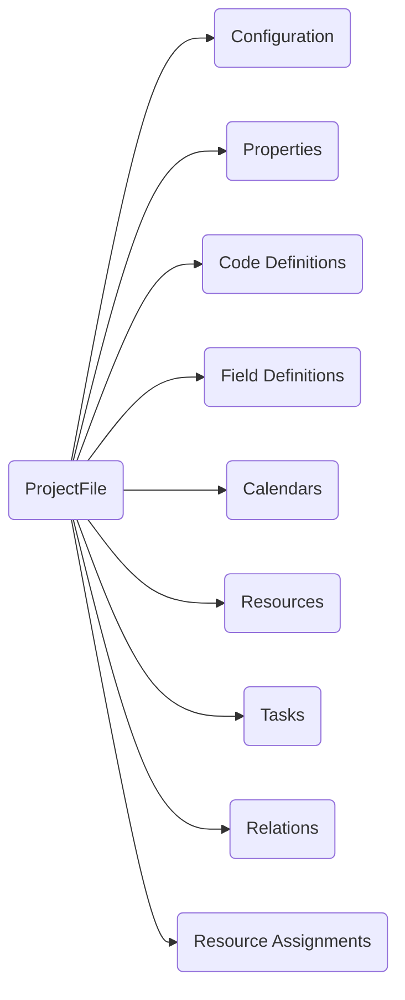
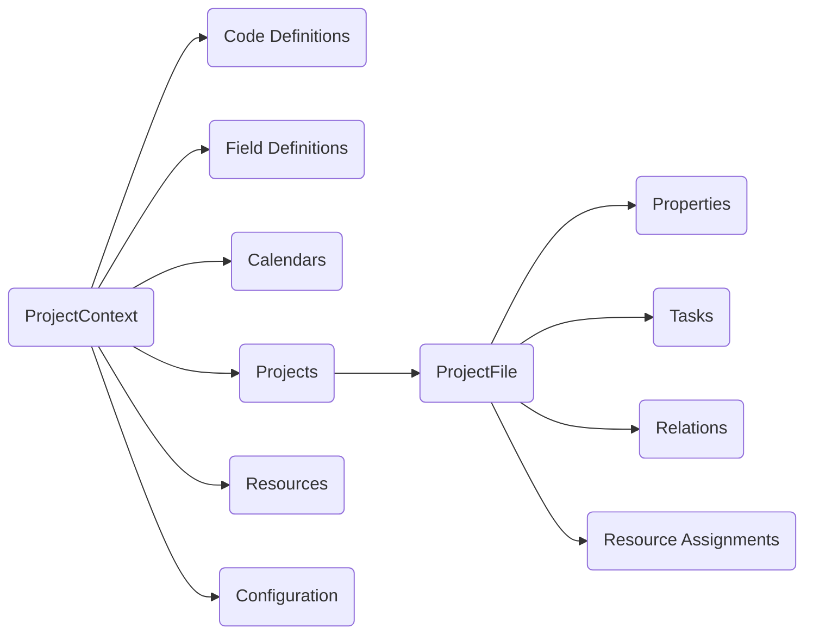

# How To: Use Project Context

These notes provide a brief description of the `ProjectContext` class' purpose.

For many people working with MPXJ, the main concern is reading a single project
and working with the data it contains. In fact most of the file formats
supported by MPXJ can only contain a single project. In this case you will just
need to work with a `ProjectFile` instance, which provides access to all of the
components of the project, as illustrated by the simplified diagram below:

For applications and file formats which support multiple projects (at
the time of writing Primavera P6 databases, XER files and PMXML files) the
you can still use a `ProjectFile` instance and work with the data shown above,
however behind the scenes the data you are working with is actually stored 
differently, as the simplified diagram below illustrates:

The `ProjectContext` class is used as a container for all common data shared
across projects (calendars, resources, code definitions and so on). Most of the
time you don't need to be aware of the `ProjectContext` class, but it is useful
to understand that when reading, for example, an XER file containing multiple
projects, all the resources, calendars and so on are actually stored as part of
the `ProjectContext`, even if you retrieve that data via a `ProjectFile`
instance.
