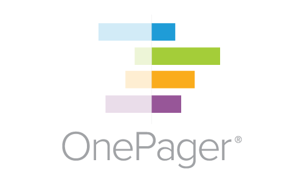
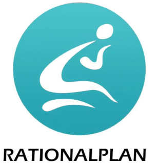

# Introduction
Welcome to MPXJ! This library enables you to read project plans (sometimes known
as schedules or programmes) from a variety of file formats and databases, and
can also write that information to a variety of file formats.

The library is based on data structures which follow the way
schedule data is represented by Microsoft Project, extended to accommodate
features and concepts from other applications.

## Sponsors
Work to build and maintain MPXJ is kindly supported by my sponsors:

Head over to my [sponsors page](https://github.com/sponsors/joniles)
if you'd like to see your name and logo here,
or if you just want to say thanks you could [buy me a coffee](https://buymeacoffee.com/joniles)!

## File Formats
MPXJ can read file formats including MPX, MPP, MSPDI, MPD, Planner, Primavera P6
PMXML and XER, Primavera P3, SureTrak, Asta Powerproject, Asta Easyplan,
Phoenix, Fasttrack, GanttProject, TurboProject, ConceptDraw PROJECT, Synchro,
Gantt Designer, SDEF, Sage 100 Contractor Schedule Grid, Project Commander,
Deltek Open Plan BK3, and Edraw Project EDPX.

As well as file-based project data, MPXJ can also read project data from
Microsoft Project Server, Primavera P6 Web Services (P6 EPPM), and Oracle
Primavera Cloud (OPC).

Finally, MPXJ can also write schedule data as MPX, MSPDI, PMXML, XER, Planner
and SDEF files.

More details of the supported file formats can be found
[here](supported-formats.md).

## Languages
MPXJ is written and maintained in Java, however this is no barrier to using
its functionality in other languages. Thanks to
[IKVM](https://github.com/ikvmnet/ikvm), MPXJ is
[available for .Net](https://www.nuget.org/packages/MPXJ.Net),
allowing it to be used from any .Net language.

There is also now a [Ruby Gem](https://rubygems.org/gems/mpxj) which provides
native Ruby access to read from schedule files using MPXJ, and a
[Python package](https://pypi.org/project/mpxj/) which wraps the Java library to
provide full read/write access to schedule files.

You may be able to leverage MPXJ from other languages too, for example the 
[PHP/Java Bridge](http://php-java-bridge.sourceforge.net)
can be used to expose the complete MPXJ API in PHP.

## Contact
Having problems? Need support? All the details you need can be found on the
[support page](support.md).

Using MPXJ successfully somewhere? I'd
[love to hear from you](mailto:jon@timephased.com) about your experiences.
Do tell me what's missing or what could be better - I can use this feedback
to guide future development work. It would also be great to add a link to your
website from the [MPXJ users page](users.md).

Finally, if you're deriving value from MPXJ, please consider
[sponsoring me](https://github.com/sponsors/joniles), to ensure I can continue
enhancing and maintaining the library,
or just [buy me a coffee](https://buymeacoffee.com/joniles) - thank you!

## Licensing
MPXJ is distributed under the terms of the
[GNU LGPL](http://www.gnu.org/licenses/licenses.html#LGPL)
a copy of which can be found in the root of the
distribution. Please read this license carefully! It will cost you nothing
to use MPXJ commercially or non-commercially, but you must comply
with the terms of the license.

Please see the legal folder within the distribution for details of the
licences for the third party libraries used by MPXJ.

## Acknowledgements
This library includes functionality provided by:

* [POI](http://poi.apache.org/)
* [IKVM](https://github.com/ikvmnet/ikvm)
* [RTF Parser Kit](https://github.com/joniles/rtfparserkit)
* [SQLITE-JDBC](https://github.com/xerial/sqlite-jdbc)
* [ZLIB/CONTRIB](https://github.com/madler/zlib)
* [JWAT](http://jwat.org/)
* [JSOUP](http://jsoup.org/)

This library has been built with the assistance of:

* [JProfiler](https://www.ej-technologies.com/products/jprofiler/overview.html)
* [Araxis Merge](https://www.araxis.com/merge/)
